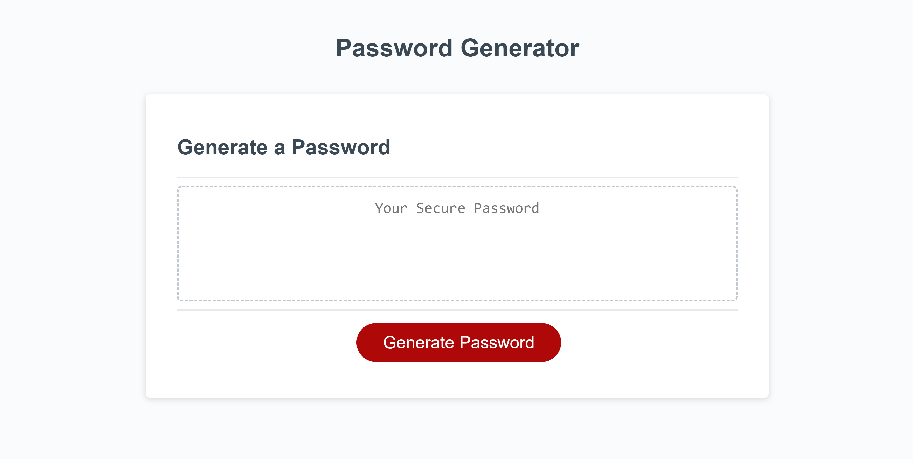

# Password Generator - HW 3
https://github.com/stevenrsewell/Password-Generator

This is an application that generates a random password based on user-chosen criterea. The user also has an option to copy the password to the clipboard.

## Dependencies Used
<ol>
<li>Javascript</li>
<li>HTML</li>
<li>CSS</li>
</ol>

## User Story
AS AN internet user ... I WANT an application that will generate a secure password that is customizable ... SO THAT I can be better protected on the internet with my authentication.

## Screenshots
